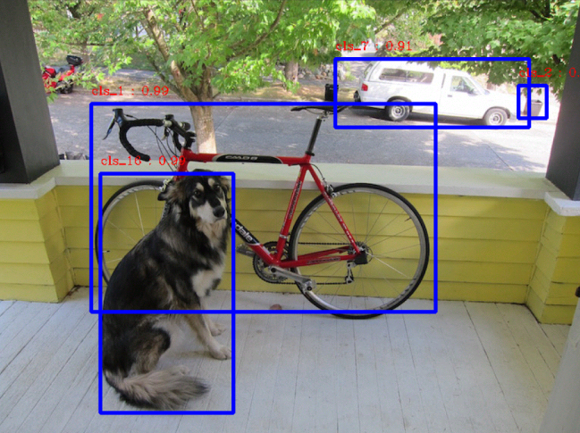
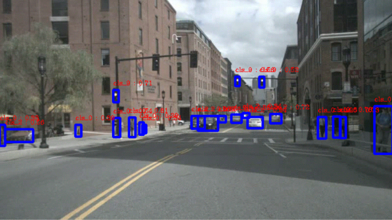

# TensorRT-YOLOv4
### demo



### Performance
| model       | input_size | GPU      | mode   | inference Time |
|----------------|------------|----------|--------|---------------|
| [yolov4](https://github.com/AlexeyAB/darknet/blob/master/cfg/yolov4.cfg)   | 608x608    | gtx 1080Ti |float32 |    23.3 ms    |
| [yolov4](https://github.com/AlexeyAB/darknet/blob/master/cfg/yolov4.cfg)   | 416x416    | gtx 1080Ti |float32 |    13.0 ms    |
| [yolov3](https://github.com/AlexeyAB/darknet/blob/master/cfg/yolov3.cfg)   | 608x608   | gtx 1080Ti |float32 |    18.2 ms    |
| [yolov3](https://github.com/AlexeyAB/darknet/blob/master/cfg/yolov3.cfg)   | 416x416   | gtx 1080Ti |float32 |    10.0 ms    |
| [yolov3-tiny](https://github.com/AlexeyAB/darknet/blob/master/cfg/yolov3-tiny.cfg)   |608x608   | gtx 1080Ti |float32 |    3.31 ms    |
| [yolov3-tiny](https://github.com/AlexeyAB/darknet/blob/master/cfg/yolov3-tiny.cfg)   | 416x416   | gtx 1080Ti |float32 |    2.01 ms    |
| [yolov3-tiny-prn](https://github.com/AlexeyAB/darknet/blob/master/cfg/yolov3-tiny-prn.cfg) | 608x608    | gtx 1080Ti |float32 |    3.05 ms    |
| [yolov3-tiny-prn](https://github.com/AlexeyAB/darknet/blob/master/cfg/yolov3-tiny-prn.cfg) | 416x416   | gtx 1080Ti |float32 |    2.01 ms    |
1. Including pre-processing and post-processing time.

### Enviroments
1. gtx 1080Ti
```
ubuntu 1604
TensorRT 5.0
cuda 9.0
python3 onnx=1.4.1 
```

### Models
1. Add (infer_thresh) and (down_stride) to your .cfg.
```
[yolo]  ## small anchor
mask = 0,1,2
anchors = ...
down_stride = 8
infer_thresh = 0.5  
...
[yolo] ## mid anchor
mask = 3,4,5
anchors = ...
down_stride = 16
infer_thresh = 0.5
...
[yolo] ## big anchor
mask = 6,7,8
anchors = .....
down_stride = 32
infer_thresh = 0.5
```
1. Convert darknet yolo to onnx. 
```
python3 tools/yolo_to_onnx.py --cfg model/yolov4.cfg --weights model/yolov4.weights --out model/yolov4.onnx
```


### Example
```bash
git clone https://github.com/CaoWGG/TensorRT-YOLOv4.git
cd TensorRT-YOLOv4
mkdir build
cd build && cmake .. && make
cd ..
## yolov3
./buildEngine -i model/yolov3.onnx -o model/yolov3.engine -b 1 -m 0
./runDet -i model/yolov3.engine -p dog.jpg -v nuscenes_mini.mp4
## yolov4
./buildEngine -i model/yolov4.onnx -o model/yolov4.engine -b 1 -m 0
./runDet -i model/yolov4.engine -p dog.jpg -v nuscenes_mini.mp4
```

### Related projects
* [DarkNet](https://github.com/AlexeyAB/darknet)
* [TensorRT-CenterNet](https://github.com/CaoWGG/TensorRT-CenterNet)
* [TensorRT](https://github.com/NVIDIA/TensorRT)
* [onnx-tensorrt](https://github.com/onnx/onnx-tensorrt)

